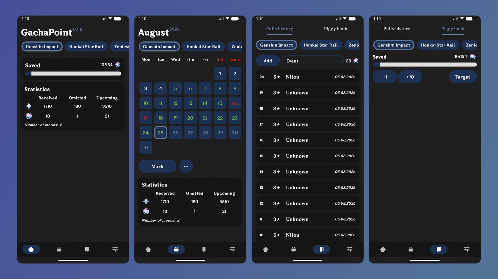

[English](/README.md) | [Русский](/README.ru.md)

  

**GachaPoint** is your open-source, all-in-one companion app for anime gacha RPGs (such as Genshin Impact, Honkai: Star Rail, Zenless Zone Zero, and more). Effortlessly track your wish history, manage savings, and keep tabs on daily pass rewards—all in one secure, fully offline application.

## Key Features
* **Subscription Calendar:** Easily track daily pass reward claims, review collected gems, and estimate upcoming yields over active periods.
* **Pity & Pull Counter:** Save and organize your summon/wish history with instant access to your roll statistics and pity counters.
* **Savings Manager:** Calculate total saved resources with automatic integration of active daily subscription payouts.
* **Daily Reminders:** Configurable notifications ensuring you never miss claiming your daily in-game rewards.
* **Privacy-First & Offline:** All your game data and historical stats are stored entirely locally on your device.

## Screenshots

  

## Tech Stack
- Java
- Gradle
- Android SDK
- Room Database
- Jetpack Compose

## License 
This project is licensed under the Apache-2.0 License.