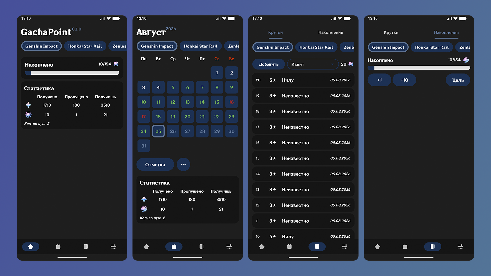

[English](/README.md) | [Русский](/README.ru.md)

  

**GachaPoint** — ваш универсальный компаньон с открытым исходным кодом для аниме гача-RPG (Genshin Impact, Honkai: Star Rail, Zenless Zone Zero и др.). Приложение позволяет удобно, безопасно и полностью автономно отслеживать историю круток, рассчитывать накопления и контролировать прогресс игровых подписок прямо на вашем устройстве.

## Ключевые возможности
* **Календарь подписок:** Наглядно отслеживайте дни сбора ежедневных наград (Снабжение, Луна и др.), анализируйте полученные гемы и планируйте будущие поступления.
* **Счётчик и история круток:** Надежно сохраняйте историю молитв/прыжков с быстрым доступом к личной статистике и гарантам.
* **Менеджер накоплений:** Рассчитывайте текущие ресурсы с автоматическим учётом доходов от активных подписок и ивентов.
* **Ежедневные напоминания:** Настраиваемые уведомления, которые не дадут забыть зайти в игру и забрать ежедневные награды.
* **Конфиденциальность и офлайн-режим:** Вся ваша база данных и персональная статистика хранятся исключительно локально на устройстве.

## Скриншоты

  

## Технологический стек
- Java
- Gradle
- Android SDK
- Room Database
- Jetpack Compose

## Лицензия 
Этот проект лицензирован под лицензией Apache-2.0